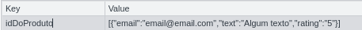

# Boas-vindas ao repositório do projeto Front-end Online Store!

Para realizar o projeto, atente-se a cada passo descrito a seguir. Se tiver qualquer dúvida, nos envie por _Slack_! #vqv 🚀

Aqui você vai encontrar os detalhes de como estruturar o desenvolvimento do seu projeto a partir deste repositório, utilizando uma branch específica e um _Pull Request_ para colocar seus códigos.

# Termos e acordos

Ao iniciar este projeto, você concorda com as diretrizes do Código de Conduta e do Manual da Pessoa Estudante da Trybe.

# Entregáveis

<details>
  <summary><strong>🤷🏽‍♀️ Como entregar</strong></summary><br />

  Para entregar o seu projeto você deverá criar um *Pull Request* neste repositório.

  Lembre-se que você pode consultar nosso conteúdo sobre [Git & GitHub](https://app.betrybe.com/course/4d67f5b4-34a6-489f-a205-b6c7dc50fc16/) e nosso [Blog - Git & GitHub](https://blog.betrybe.com/tecnologia/git-e-github/) sempre que precisar!
</details>

<details>
  <summary><strong>👨‍💻 O que deverá ser desenvolvido</strong></summary><br />

  Neste projeto você criará uma versão simplificada, sem persistência no banco de dados, de uma **loja online**, desenvolvendo em grupo suas funcionalidades de acordo com demandas definidas em um quadro _Kanban_, em um cenário próximo ao do mercado de trabalho.
  
  A partir dessas demandas, teremos uma aplicação em que pessoas usuárias poderão:
  - Buscar produtos por termos e categorias a partir da _API do Mercado Livre_;
  - Interagir com os produtos buscados de modo a adicioná-los e removê-los de um carrinho de compras em diferentes quantidades;
  - Visualizar detalhes e avaliações prévias de um produto, bem como criar novas avaliações e;
  - Simular a finalização da compra dos itens selecionados.
</details>

<details>
  <summary><strong>:memo: Habilidades</strong></summary><br />

  Neste projeto você será irá:

  * Entender o que são Métodos Ágeis;
  * Entender o que é Kanban;
  * Entender o que é Scrum;
  * Trabalhar em equipes utilizando Kanban ou Scrum de maneira eficaz;
  * Praticar todas as habilidades desenvolvidas até agora no módulo de Front-end.
</details>

<details>
  <summary><strong>🗓 Data de Entrega</strong></summary><br />
  
  * Este projeto é em grupo;
  * Serão `4` dias de projeto;
  * Data para entrega final do projeto: `29/03/2023 14:00`.

</details>

# Orientações

<details>
  <summary><strong>‼️ Antes de começar a desenvolver</strong></summary><br />

  1. Clone o repositório

  - Use o comando: `git clone git@github.com:tryber/sd-029-a-project-frontend-online-store.git`.
  - Entre na pasta do repositório que você acabou de clonar:
    - `cd sd-029-a-project-frontend-online-store`
  - Vá para a branch do seu grupo:
    - `git checkout main-group-XX && git pull`, em que `XX` é o número do seu grupo. Exemplos: `main-group-1`, `main-group-22`.

  2. Instale as dependências

  - `npm install`.
  
  3. Faça alterações separadas por novas branchs criadas a partir da branch `main-group-XX`, criando uma nova branch para cada demanda

  - Verifique que você está na branch `main-group-XX`
    - Exemplo: `git branch`
  - Se não estiver, mude para a branch `main-group-XX`
    - Exemplo: `git checkout main-group-XX && git pull`
  - Crie uma branch para a demanda que você vai desenvolver do seu projeto
    - Você deve criar uma branch com uma breve descrição da demanda a ser desenvolvida
    - Exemplo: `git checkout -b main-group-XX-cria-campo-de-busca`

  4. Adicione as mudanças ao _stage_ do Git e faça um `commit`

  - Verifique que as mudanças ainda não estão no _stage_
    - Exemplo: `git status` (devem aparecer listadas as novas alterações em vermelho)
  - Adicione o novo arquivo ao _stage_ do Git
    - Exemplo:
      - `git add .` (adicionando todas as mudanças - _que estavam em vermelho_ - ao stage do Git)
      - `git status` (devem aparecer listadas as novas alterações em verde)
  - Faça o `commit`
    - Exemplo:
      - `git commit -m 'cria componente de busca'` (fazendo o primeiro commit)
      - `git status` (deve aparecer uma mensagem tipo _nothing to commit_ )

  5. Adicione a sua branch com o novo `commit` ao repositório remoto

  - Usando o exemplo anterior: `git push -u origin main-group-XX-cria-campo-de-busca`

  6. Crie um novo `Pull Request` _(PR)_

  - Vá até a página de _Pull Requests_ do [repositório no GitHub](https://github.com/tryber/sd-029-a-project-frontend-online-store/pulls)
  - Clique no botão verde _"New pull request"_
  - Clique na caixa de seleção _"Compare"_ e escolha a sua branch **com atenção**
  - Coloque um título para a sua _Pull Request_
    - Exemplo: _"[GRUPO XX] Cria tela de busca"_
  - Clique no botão verde _"Create pull request"_
  - Adicione uma descrição para o _Pull Request_ e clique no botão verde _"Create pull request"_
  - **Não se preocupe em preencher mais nada por enquanto!**
  - Volte até a [página de _Pull Requests_ do repositório](https://github.com/tryber/sd-029-a-project-frontend-online-store/pulls) e confira que o seu _Pull Request_ está criado

  7. Assim que aprovado por pelo menos uma pessoa do seu grupo e o _Linter_ estiver adereçado (veja como nas próximas sessões), acesse **SEU** _Pull Request_ e clique no botão _"Merge pull request"_
  
</details>

<details>
  <summary><strong>⌨️ Durante o desenvolvimento</strong></summary><br />

  - Faça `commits` das alterações que você fizer no código regularmente

  - Lembre-se de sempre após um (ou alguns) `commits` atualizar o repositório remoto

  - Os comandos que você utilizará com mais frequência são:
    1. `git status` _(para verificar o que está em vermelho - fora do stage - e o que está em verde - no stage)_
    2. `git add` _(para adicionar arquivos ao stage do Git)_
    3. `git commit` _(para criar um commit com os arquivos que estão no stage do Git)_
    4. `git push -u origin nome-da-branch` _(para enviar o commit para o repositório remoto na primeira vez que fizer o `push` de uma nova branch)_
    5. `git push` _(para enviar o commit para o repositório remoto após o passo anterior)_

</details>

<details>
  <summary><strong>🤝 Depois de terminar o desenvolvimento (opcional)</strong></summary><br />

  Para sinalizar que o seu projeto está pronto para o _"Code Review"_, faça o seguinte:

  - Vá até a página **DO SEU** _Pull Request_, adicione a label de _"code-review"_ e marque seus colegas:

    - No menu à direita, clique no _link_ **"Labels"** e escolha a _label_ **code-review**;

    - No menu à direita, clique no _link_ **"Assignees"** e escolha **o seu usuário**;

    - No menu à direita, clique no _link_ **"Reviewers"** e digite `students`, selecione o time `tryber/students-sd-029-a`.

  Caso tenha alguma dúvida, [aqui tem um video explicativo](https://vimeo.com/362189205).

</details>

<details>
  <summary><strong>🕵🏿 Revisando um pull request</strong></summary><br />

  Use o conteúdo sobre [Code Review](https://app.betrybe.com/course/real-life-engineer/code-review) para te ajudar a revisar os _Pull Requests_.

</details>

<details>
  <summary><strong>🎛 Linter</strong></summary><br />

O [ESLint](https://eslint.org/) será utilizado para fazer a análise estática do seu código garantindo a sua qualidade de forma a tê-lo mais legível, de mais fácil manutenção e seguindo as boas práticas de desenvolvimento. 
  
  Para rodar o linter localmente no seu projeto, execute o comando abaixo:

  ```bash
  npm run lint
  ```

  Você pode instalar o plugin do `ESLint` no `VSCode`. Para isso, bastar ir em extensions e baixar o [plugin `ESLint`](https://marketplace.visualstudio.com/items?itemName=dbaeumer.vscode-eslint) e instalá-lo.

Você pode consultar nosso contúdo sobre sobre [`ESLint`](https://app.betrybe.com/course/real-life-engineer/eslint) caso ainda tenha alguma dúvida.

 :warning: **IMPORTANTE!** :warning:  Pull Requests com **erros de linter não serão avaliados**. Resolva os erros de linter antes de finalizar o desenvolvimento
  
</details>
  
<details>
  <summary><strong>:busts_in_silhouette: Trello como ferramenta Kanban</strong></summary><br />

  Uma forma para seu grupo organizar as atividades e dividir as tarefas é através de um modelo de Kanban. A Trybe disponibilizou no [Trello](https://trello.com/) um [board pré-configurado](https://trello.com/b/9mjukxCq/frontend-online-store) para que você possa duplicá-lo para usar com seu grupo.

  

  Siga os passos abaixo para duplicar o board:

  - Acesse o [board](https://trello.com/b/9mjukxCq/frontend-online-store);
  - Abra o menu no canto superior direito;
  - Selecione "copiar quadros";
  - Defina o time do seu grupo e um título para o board;
  - Clique em `criar`;
  - Personalize seu novo Kanban.
</details>

<details>
  <summary><strong>🛠 Testes</strong></summary><br />

 A [React Testing Library (RTL)](https://testing-library.com/docs/react-testing-library/intro) será utilizada para execução dos testes.

 Na descrição dos requisitos será pedido a adição de atributos `data-testid` nos elementos _HTML_. 
  
 Para deixar evidente esta configuração veja o exemplo: 
  - se o requisito pedido for _"crie um botão e adicione o id de teste (ou `data-testid`) com o valor `my-action`"_, você pode escrever:

  ```html
  <button data-testid="my-action" ></button>
  ```

  ou

  ```html
  <a data-testid="my-action"><a/>
  ```

O atributo `data-testid="my-action"` servirá para que a React Testing Library (RTL) identifique o elemento. Desta forma será possível realizar testes unitários focados no comportamento da aplicação. 
    
  Você pode executar todos os testes unitários localmente para verificar a solução proposta com o comando abaixo:

  ```bash
  npm test
  ```

  Você pode executar os testes para um único requisito passando, como parâmetro para o comando, o nome do arquivo de teste alvo:

  ```bash
  npm test src/__tests__/requirement1.test.js
  ```

  ** :eyes: De olho na dica:** Desativando testes

  Caso queira avaliar apenas um tópico do requisito, você pode usar o `.only` após o `it`. Com isso, será possível que apenas esse tópico rode localmente e seja avaliado.

  
  

  :warning: **ATENÇÃO!** :warning: O avaliador automático não avalia, necessariamente, seu projeto na ordem em que os requisitos aparecem no readme. Isso acontece para deixar o processo de avaliação mais rápido. Então não se assuste se isso acontecer, ok?
</details>

<details>
  <summary><strong>:convenience_store: Desenvolvimento </strong></summary><br />

  ### Documentação da API do Mercado Livre

  Sua página _web_ irá consumir os dados da API do _Mercado Livre_ para realizar a busca de itens da sua loja online. Para realizar essas buscas, você precisará consultar os seguintes _endpoints_:

  - Para listar as categorias disponíveis:
    - Endpoint: https://api.mercadolibre.com/sites/MLB/categories
  - Para buscar por itens por termo:
    - Parâmetro de busca $QUERY (este parâmetro deve ser substituído pelo valor do campo de busca)
    - Endpoint: https://api.mercadolibre.com/sites/MLB/search?q=$QUERY
  - Para buscar itens por categoria:
    - Parâmetro de busca $CATEGORY_ID (este parâmetro deve ser substituído pelo ID da categoria selecionada)
    - Endpoint: https://api.mercadolibre.com/sites/MLB/search?category=$CATEGORY_ID
  - Para buscar itens de uma categoria por termo (vale ressaltar, que este endpoint não necessariamente precisa receber ambos os parâmetros para funcionar):
    - Parâmetro de busca $QUERY (este parâmetro deve ser substituído pelo valor do campo de busca)
    - Parâmetro de busca $CATEGORY_ID (este parâmetro deve ser substituído pelo ID da categoria selecionada)
    - Endpoint: https://api.mercadolibre.com/sites/MLB/search?category=$CATEGORY_ID&q=$QUERY
  - Para buscar detalhes de um item especifico:
    - Parâmetro de busca $PRODUCT_ID (este parâmetro deve ser substituído pelo valor do campo de busca)
    - Endpoint: https://api.mercadolibre.com/items/$PRODUCT_ID


  Se você quiser aprender mais sobre a API do _Mercado Livre_, veja a [documentação](https://developers.mercadolivre.com.br/pt_br/itens-e-buscas).

  #### Exemplo de requisição para listar categorias

  ```
  "https://api.mercadolibre.com/sites/MLB/categories"
  ```

  O retorno desse endpoint será algo no formato:

  ```json
  [
      {
          "id": "MLB5672",
          "name": "Acessórios para Veículos"
      },
      ...
  ]
  ```

  #### Exemplo de requisição de busca

  ```
  "https://api.mercadolibre.com/sites/MLB/search?category=MLB1055&q=Motorola"
  ```

  O retorno desse endpoint será algo como o exemplo [deste arquivo](exemplo-motorola.json).

  :eyes: **De olho na dica:** Se der erro de CORS aperte `ctrl + shift + r` no seu navegador.

  ### Organização do grupo de trabalho

Para maior eficiência de trabalho e para minimizar os conflitos de união de vários códigos é importante que o grupo se organize utilizando a metodologia _Kanban_.

Você verá que os requisitos do projeto têm, além das observações técnicas e do que será avaliado, descrições tais quais se veriam em um projeto real. Como futura pessoa desenvolvedora é **importante** você ser capaz de ler e interpretar as descrições dos requisitos para transformá-las em produtos ou, se houver dúvida, **saber como resolver tais dúvidas!** 

  ### Grupos de prioridade dos requisitos

  Os requisitos estão organizados por prioridade. **Demandas de um mesmo grupo de prioridade podem ser realizadas em paralelo e são pré-requisito para as demandas do grupo de prioridade seguinte.** 
  
  Por exemplo:

  - **Requisitos 1 e 2:** Prioridade 0 (Devem ser feitos PRIMEIRO);
  - **Requisitos 3 a 5:** Prioridade 1 (Devem ser feitos APÓS OS REQUISITO 1 E 2, mas podem ser feitos em paralelo);
  - **Requisitos 5 a 7:** Prioridade 2 (Devem ser feitos APÓS OS REQUISITO 3 A 5, mas podem ser feitos em paralelo);
  - Assim por diante.

  Se você não seguir a ordem de prioridades terá mais **conflitos de merge** e **demandas concorrentes**, em que o avanço de uma depende, necessariamente, do avanço de outra.

  ### Requisitos Bônus

A capacidade de priorizar tarefas será constantemente requisitada em sua vida profissional como pessoa desenvolvedora, aproveite o exercício e priorize, neste projeto, as atividades essenciais para depois sequir para as extras (requisitos bônus).
  
</details>
 

<details>
  <summary><strong>💻 Protótipo do projeto no Figma</strong></summary><br />

Além da qualidade do código e do atendimento aos requisitos, um bom layout é um dos aspectos responsáveis por melhorar a usabilidade de uma aplicação e turbinar seu portfólio!

Você pode estar se perguntando: *"Como deixo meu projeto com um layout mais atrativo?"* 🤔

Para isso, disponibilizamos esse [protótipo do Figma](https://www.figma.com/file/E3KIkTRcdEnF30cKEqKFjn/%5BProjeto%5D%5BFrontend%5D-Front-end-Online-Store) para lhe ajudar !

⚠️ A estilização de sua aplicação não será avaliada nesse projeto, portanto esse protótipo é apenas uma **sugestão** e seu uso é **opcional**. Sinta-se à vontade para modificar o layout e deixá-lo do seu jeito.

</details>

<details>
  <summary><strong>🗂 Compartilhe seu portfólio!</strong></summary><br />

  Você sabia que o LinkedIn é a principal rede social profissional e compartilhar o seu aprendizado lá é muito importante para quem deseja construir uma carreira de sucesso? Compartilhe esse projeto no seu LinkedIn, marque o perfil da Trybe (@trybe) e mostre para a sua rede toda a sua evolução.
</details>

# Requisitos

:warning: **ATENÇÃO - 01** Pull Requests com erros de linter não serão avaliados.

:warning: **ATENÇÃO - 02** As imagens são meramente ilustrativas para visualizar o fluxo da aplicação, os nomes devem seguir os requisitos e não as imagens.

:warning: **ATENÇÃO - 03** Para que os testes funcionem corretamente, é necessario que o seu `BrowserRouter` fique dentro do arquivo `index.js`, envolvendo o componente <App />.

:warning: **ATENÇÃO - 04** Não recomendamos utilizar o localStorage para guardar e compartilhar dados entre componentes. Faça isso apenas quando o requisito pedir explicitamente a persistência de dados.

## 1. Implemente o módulo de acesso à api do Mercado Livre

**PRIORIDADE 0** 

<details>
<summary>Implemente um módulo que acessa a API do Mercado Livre:</summary>

- Utilize (**OBRIGATORIAMENTE**) o arquivo `src/services/api.js` para acessar a API do Mercado Livre em sua aplicação;
- Utilize (**OBRIGATORIAMENTE**) o módulo **[Fetch](https://developer.mozilla.org/en-US/docs/Web/API/Fetch_API/Using_Fetch)** para realizar as requisições;
- <details><summary>Você deve (<b>OBRIGATORIAMENTE</b>) implementar as funções <code>getCategories()</code> e <code>getProductsFromCategoryAndQuery()</code> que estão no arquivo <code>src/services/api.js</code>:</summary>

  ```javascript
  export async function getCategories() {
    // Implemente aqui
  }

  export async function getProductsFromCategoryAndQuery(/* categoryId, query */) {
    // Implemente aqui! Quando o fizer, descomente os parâmetros que essa função recebe
    // Essa função será chamada em vários momentos do projeto para buscar os produtos pela categoria e querys
    // Dentro da função você pode usar condicionais definir qual API utilizar
  }
  ```
  Essas funções devem realizar uma chamada para a [API do Mercado Livre](#-Documentação-da-API-do-Mercado-Livre) e retornar uma [Promise](https://developer.mozilla.org/en-US/docs/Web/JavaScript/Reference/Global_Objects/Promise) com os dados de resultado. Com essa implementação, o uso dessas funções deve ser algo parecido com o exemplo abaixo:

  ```javascript
  import * as api from './services/api'

  api.getCategories().then(categories => { console.log(categories) })
  ```

  A variável `categories` deve conter o objeto JSON com as categorias obtidas através da chamada da API do Mercado Livre:

  ```json
  [
    {
        "id": "MLB5672",
        "name": "Acessórios para Veículos"
    },
    {
        "id": "MLB271599",
        "name": "Agro"
    },
    {
        "id": "MLB1403",
        "name": "Alimentos e Bebidas"
    }
  ]
  ```
  </details>
  
- Sinta-se livre para criar novas funções neste arquivo, mas apenas as funções <code>getCategories()</code> e <code>getProductsFromCategoryAndQuery()</code> serão avaliadas.
</details><br />

<details>
  <summary><strong>O que será verificado</strong></summary>

  - Implementa a função `getCategories`;
  - Implementa a função `getProductsFromCategoryAndQuery`.
</details>

---

## 2. Crie uma página de listagem de produtos vazia

**PRIORIDADE 0** 

A tela principal da plataforma é a de **listagem de produtos**, onde a pessoa usuária poderá buscar produtos para adicionar ao carrinho, além de filtrar suas buscas.

<details><summary>Crie o campo de busca da tela principal, que será utilizado para listar os produtos encontrados:</summary>

  * Esta página deve ficar no path `/`, renderizável a partir do acesso ao componente `<App />`;
  * Inicialmente a listagem de produtos deve estar vazia;
  * Quando a lista estiver vazia, a página deve mostrar a mensagem `"Digite algum termo de pesquisa ou escolha uma categoria."`;
  * Adicione o atributo `data-testid` com o valor `home-initial-message` no elemento da mensagem.
</details>

<details><summary><b>Exemplo de página de listagem de produtos antes da busca</b></summary>
  
  A imagem pode ser acessada no arquivo `./wireframes/card_02.png`

  
</details><br />

<details>
  <summary><strong>O que será verificado</strong></summary>
  - A tela contém a mensagem pedida: 'Digite algum termo de pesquisa ou escolha uma categoria.'.
</details>

---

## 3. Crie a página do carrinho de compras

**PRIORIDADE 1**

A pessoa usuária poderá adicionar produtos em seu carrinho de compras, a partir da listagem dos produtos.

Crie uma tela que representará o carrinho de compras da aplicação. Além disso, na tela principal, crie um botão que redireciona à página do carrinho de compras. Inicialmente, o carrinho deve estar vazio.

<details><summary> Crie uma tela que represente o carrinho de compras:</summary>

  * Quando não existirem produtos no carrinho de compras, a página deve exibir a mensagem `"Seu carrinho está vazio"`;
  * Adicione o atributo `data-testid` com o valor `shopping-cart-empty-message` no elemento da mensagem.

  <details><summary><b>Exemplo da tela Carrinho de Compras</b></summary>

  
  </details>
</details>

<details><summary> Na tela principal, crie um elemento que redirecione a pessoa usuária à página do carrinho de compras:</summary>

  * O elemento deve estar visível na página inicial (listagem de produtos);
  * Este elemento também deverá estar presente na página de detalhes de um produto, mas não se preocupe com isso neste momento, estará descrito em um requisito posterior;
  * Adicione o atributo `data-testid` com o valor `shopping-cart-button` no elemento que redireciona à pagina de carrinho de compras. 
  
  :warning: **Atenção!** O **elemento** que faz o direcionamento para a página do carrinho é quem deve conter o `data-testid`. Se você fizer isso com um `<Link />`, por exemplo, é este quem deve conter o `data-testid`.

  <details><summary><b>Exemplo da tela principal com o elemento que redireciona para a tela do carrinho:</b></summary>

    
  </details>
</details><br />

<details>
  <summary><strong>O que será verificado</strong></summary>

  - A home deve ter o botão do carrinho de compras;
  - Clicar no botão deve levar à página do carrinho vazio, com a mensagem 'Seu carrinho está vazio' nela.
</details>

---

## 4. Liste as categorias de produtos disponíveis via API na página principal

**PRIORIDADE 1**

A tela principal (listagem dos produtos) deve conter uma lista de categorias, que será utilizada para filtrar a busca por categoria. As categorias podem ser obtidas pela API do Mercado Livre. A requisição para essa API deve ser feita uma única vez, após o carregamento da tela.

<details><summary> Na tela principal, liste as categorias obtidas pela API do Mercado Livre:</summary>
  
  * :eyes: **De olho na dica**: Posteriormente as categorias serão utilizadas para realizar novas requisições para listar produtos. Ou seja, elas serão clicáveis para aplicar um filtro de categoria. **Sugerimos a utilização do elemento do tipo `button` ou do tipo `radio button` para listar as categorias. Por hora, neste requisito, será avaliado apenas a listagem das categorias, conforme protótipo.**
  * Adicione o atributo `data-testid` com o valor `category` nos elementos que receberão o nome da categoria. **Atenção!** Caso você opte por utilizar `radio buttons` para realizar a listagem, as `labels` dos elementos que deverão receber o `data-testid`, e não se esqueça da propriedade `htmlFor`.

  
</details><br />

<details>
  <summary><strong>O que será verificado</strong></summary>
  
  - Exibe as categorias retornadas pela API na página de listagem de produtos.
</details>

---

## 5. Liste os produtos buscados por termos, com os dados resumidos, associados a esses termos

**PRIORIDADE 1**

A alma da aplicação é a sua lógica de busca e listagem de produtos. Após digitar seus termos no `input` da tela principal e clicar no botão de busca, uma requisição deverá ser feita à API do Mercado Livre, tendo como parâmetros a frase digitada. Os produtos retornados pela API devem ser listados na tela.

<details><summary> Na tela principal, crie a listagem dos produtos recebidos pela API do Mercado Livre ao clicar no botão de busca:</summary>

  * A tela principal deve possuir um elemento `input` com o atributo `data-testid="query-input"`;
  * A tela principal deve possuir um elemento com o atributo `data-testid="query-button"` que, ao ser clicado, dispara a chamada para a API com o termo de busca pesquisado (ou seja, com o valor digitado no `input`);
  * Renderize na tela uma exibição resumida de todos os produtos retornados pela API, contendo o nome, a imagem e o preço de cada produto;
  * Adicione o atributo `data-testid="product"` nos elementos que possuem os dados dos produtos;
  * Caso a busca não retorne resultados, renderize na tela o texto <code>"Nenhum produto foi encontrado"</code>.
</details><br />

<details><summary>Exemplo da tela principal após uma busca por produtos:</summary>

  
</details>
<details><summary>Exemplo da tela principal caso a busca não retorne resultados:</summary>

  
</details><br />

<details>
  <summary><strong>O que será verificado</strong></summary>

  - Exibe todos os produtos retornados pela API, dado um determinado filtro.

</details>

---

## 6. Selecione uma categoria e mostre somente os produtos daquela categoria

**PRIORIDADE 2** 

Quando a pessoa usuária clicar em uma das categorias listadas na tela principal, a aplicação deverá listar todos os produtos encontrados daquela categoria.

<details><summary> Na tela principal, ao clicar em uma das categorias listadas, crie a listagem dos produtos dessa categoria:</summary>

  * Ao clicar em uma das categorias listadas, faça uma requisição à API do Mercado Livre e renderize na tela uma exibição resumida de todos os produtos retornados dessa categoria, contendo o nome, a imagem e o preço de cada produto;
  * Adicione o atributo `data-testid="product"` nos elementos que possuem os dados dos produtos;
  * :eyes: **De olho na dica**: Lembre-se de consultar os endpoints da API para encontrar a requisição de busca por categoria (mais informações na [documentação da API](#documentação-da-api-do-mercado-livre), na seção **Desenvolvimento**).
</details><br />

<details>
  <summary><strong>O que será verificado</strong></summary>

  - Exibe corretamente na página somente os produtos da categoria clicada.
</details>

---

## 7. Redirecione para uma tela com a exibição detalhada ao clicar na exibição resumida de um produto

**PRIORIDADE 3**

Agora que a listagem dos produtos está criada, você deverá criar a página de detalhes de um produto. 

Ao clicar "no card" de um produto, a pessoa usuária deve ser direcionada para uma página contendo o nome, uma imagem, o preço e a especificação técnica desse produto. Além disso, essa página deve ter um botão que, ao clicar, a pessoa usuária deve ser redirecionada para a página do carrinho de compras.

<details><summary> Exemplo da tela de detalhes de um produto:</summary>

  
</details><br />


<details><summary> Ao clicar em "um card" de um produto (o elemento com <code>data-testid="product"</code>), a pessoa usuária deve ser redirecionada para uma página contendo os detalhes do produto:</summary>

  * Adicione o atributo `data-testid="product-detail-link"` no elemento que, ao ser clicado, enviará a pessoa usuária para a página de detalhes do produto. Você deve adicionar esse atributo para todos os produtos;
  * A página de detalhes deve possuir o nome, a imagem, o preço e qualquer outra informação adicional do produto que você desejar;
  * Adicione o atributo `data-testid="product-detail-name"` no elemento que, na tela de detalhes, possui o nome do produto;
  * Adicione o atributo `data-testid="product-detail-image"` no elemento que, na tela de detalhes, possui a imagem do produto;
  * Adicione o atributo `data-testid="product-detail-price"` no elemento que, na tela de detalhes, possui o preço do produto;
  * Adicione o atributo `data-testid="shopping-cart-button"` ao botão que, ao ser clicado, redireciona para a página do carrinho de compras.
</details><br />

<details>
  <summary><strong>O que será verificado</strong></summary>

  - Clicar no card de um produto leva à página com seus detalhes;
  - Exibe corretamente o nome, a imagem e o preço do produto em sua página de detalhes;
  - Exibe o botão que redireciona à página do carrinho de compras;
  - Clicar no botão do carrinho leva à página do carrinho de compras com a mensagem 'Seu carrinho está vazio' na tela.
</details>

---

## 8. Adicione produtos ao carrinho a partir da tela de listagem de produtos

**PRIORIDADE 3**

A pessoa usuária pode adicionar um produto ao carrinho de compras a partir da página principal contendo a listagem dos produtos.

Todos os produtos que foram adicionados ao carrinho devem aparecer na tela do Carrinho de Compras.

* Lembrete: Quando renderizamos os itens da categoria, os dados dos produtos já estão dentro da sua aplicação. Pense em como armazenar eles sem a necessidade de fazer outra requisição.

<details><summary><b>Exemplo da página principal</b></summary>

  
</details><br />

<details><summary> Na tela principal, crie um elemento em cada produto que, ao ser clicado, adiciona o produto ao carrinho de compras:</summary>

  * Adicione o atributo `data-testid="product-add-to-cart"` no elemento que executa a ação de adicionar o produto ao carrinho de compras.

  * Ao adicionar o produto no carrinho, salve ele também no local storage.
</details>


<details><summary> Na tela do Carrinho de Compras, renderize todos os produtos que foram adicionados ao carrinho:</summary>
  
  * Os produtos na tela do Carrinho de Compras devem possuir o nome, o preço e a quantidade;
  * Adicione o atributo `data-testid="shopping-cart-product-name"` no elemento que possui o nome do produto na tela do carrinho de compras. Você deve adicionar esse atributo para todos os produtos na tela do carrinho;
  * Adicione o atributo `data-testid="shopping-cart-product-quantity"` no elemento que possui a quantidade do produto na tela do carrinho de compras. Você deve adicionar esse atributo para todos os produtos na tela do carrinho.
</details><br />
<details>
  <summary><strong>O que será verificado</strong></summary>

  - Adiciona um produto ao carrinho a partir da tela principal;
  - Ao adicionar um produto a partir da tela inicial e clicar no carrinho de compras, você não deverá fazer nenhuma requisição(fetch). Recupere os dados por meio das props ou de outra forma. 
</details>

---

## 9. Adicione um produto ao carrinho a partir de sua tela de exibição detalhada

**PRIORIDADE 3**

A partir da tela de detalhes de um produto, deve ser possível adicioná-lo ao carrinho de compras.

<details><summary> Na tela de detalhes de um produto, crie um elemento que adicione o produto ao carrinho:</summary>

  * Adicione o atributo `data-testid="product-detail-add-to-cart"` no elemento que possui a ação de adicionar o produto ao carrinho de compras.
  * Ainda na tela de detalhes de um produto, adicione um elemento que, ao ser clicado, redireciona a pessoa usuária para a tela de carrinho. Esse elemento precisa ter o atributo `data-testid="shopping-cart-button"`.
  * Ao adicionar o produto no carrinho, salve ele também no local storage.
</details>
<details><summary> Na tela do carrinho de compras, renderize todos os produtos adicionados ao carrinho:</summary>

  * Os produtos na tela do Carrinho de Compras devem possuir o nome, o preço e a quantidade;
  * Adicione o atributo `data-testid="shopping-cart-product-name"` no elemento que possui o nome do produto na tela do carrinho de compras. Você deve adicionar esse atributo para todos os produtos na tela do carrinho;
  * Adicione o atributo `data-testid="shopping-cart-product-quantity"` no elemento que possui a quantidade do produto na tela do carrinho de compras. Você deve adicionar esse atributo para todos os produtos na tela do carrinho.
</details>

<details>
  <summary><strong>O que será verificado</strong></summary>

  - Adiciona um produto ao carrinho a partir da sua tela de detalhes;
  - Avalia se o nome e a quantidade do produto adicionado são exibidos corretamente na tela do carrinho de compras.
</details>

---

## 10. Visualize a lista de produtos adicionados ao carrinho em sua página e permita a manipulação da sua quantidade

**PRIORIDADE 3**

Ao entrar na página, todos os produtos salvos no local storage devem ser renderizados.

Na tela do Carrinho de Compras, deve ser possível aumentar e/ou diminuir a quantidade do produto. Também deve ser possível excluir um produto do carrinho.

<details><summary> Exemplo da tela do carrinho de compras:</summary>

  
</details><br />

<details><summary> Na página do carrinho de compras, crie dois elementos para cada produto que, ao serem clicados, diminuem ou aumentam a quantidade desse produto presente no carrinho:</summary>

  * Adicione elementos na página do carrinho de compras para aumentar ou diminuir a quantidade de cada produto presente no carrinho;
  * A quantidade mínima de um produto no carrinho deve ser `1`;
  * Adicione o atributo `data-testid="product-increase-quantity"` no elemento que aumenta a quantidade de um produto. Adicione esse elemento para cada produto;
  * Adicione o atributo `data-testid="product-decrease-quantity"` no elemento que diminui a quantidade de um produto. Adicione esse elemento para cada produto;
  * Adicione o atributo `data-testid="remove-product"` no elemento que remove o produto do carrinho. Adicione esse elemento para cada produto.
      * É possível remover um item do carrinho de compras. Essa remoção deve refletir o local storage.
</details><br />

<details>
  <summary><strong>O que será verificado</strong></summary>
  - Que os itens salvos anteriormente no local storage são recuperados e renderizados no carrinho;
  - Adiciona produtos ao carrinho e manipula suas quantidades;
  - É possível remover um item do carrinho de compras. Essa remoção deve refletir o local storage.
</details>

---

## 11. Avalie e comente acerca de um produto em sua tela de exibição detalhada

**PRIORIDADE 3** 

Na tela de detalhes de um produto, deve existir um formulário para adicionar avaliações sobre ele. Este formulário deve conter um campo para o e-mail da pessoa avaliadora, uma nota entre 1 e 5 e um campo para comentários sobre o produto. Além disso, os campos `e-mail` e `nota` devem ser obrigatórios e o e-mail deve ser válido (exemplo: `teste@trybe.com`).

A lista de avaliações já realizadas devem ser renderizadas na tela de detalhes do produto caso a pessoa usuária recarregue a página.

<details><summary><b> Exemplo da tela de detalhes contendo o formulário para adicionar avaliações:</b></summary>

 
</details><br />

<details><summary><b> Exemplo da tela de detalhes contendo avaliações:</b></summary>

  
</details><br />

<details><summary> Na tela de detalhes de um produto, crie um formulário para adicionar avaliações:</summary>

  * Crie um `input` com o atributo `data-testid="product-detail-email"`, onde a pessoa usuária colocará o email;
  * Crie 5 elementos contendo o atributo `data-testid="${index}-rating"`, com o `${index}` indo de 1 a 5, para a pessoa escolher qual nota dar ao produto. **Neste formulário, os 5 elementos precisam ser renderizados na tela, independente da nota atribuída pela pessoa avaliadora**;
  * Adicione um campo de texto com o atributo `data-testid="product-detail-evaluation"` para a pessoa usuária escrever algo sobre o produto;
  * Adicione um botão com o atributo `data-testid="submit-review-btn"` para a pessoa usuária enviar a avaliação.
</details><br />

<details><summary>Avalie se o formulário é valido:</summary>

  - Ao clicar no botão com o atributo `data-testid="submit-review-btn"`, **caso algum campo não esteja preenchido ou possua algum campo inválido**, um elemento contendo a mensagem `Campos inválidos` deve ser renderizado. Este elemento deve possuir o atributo `data-testid="error-msg"`;
</details><br />

<details><summary> Renderize as avaliações criadas a partir do formulário:</summary>

  * Ao clicar no botão com o atributo `data-testid="submit-review-btn"`, as informações inseridas no formulário deverão ser renderizadas na tela de detalhes do produto, abaixo do formulário, e os campos de texto do formulário devem ser limpos;
  * As avaliações devem ser salvas no **local storage**;
  * As chaves das avaliações no local storage devem ser o **id do produto**;
  * Os valores das avaliações no local storage devem ter o sequinte formato:
  ```js
  [
    { 
      email: 'email@email.com',
      text: 'Algum texto',
      rating: '5',
    },
  ]
  ```

  
  * O `e-mail` da avaliação deve conter o `data-testid="review-card-email"`;
  * A `nota` da avaliação deve conter o `data-testid="review-card-rating"`;
  * O `comentario` da avaliação deve conter o `data-testid="review-card-evaluation"`.
  
</details><br />
<details>
  <summary><strong>O que será verificado</strong></summary>

  - Avalia se é possível realizar uma avaliação na tela de detalhes de um produto;
  - Avalia se os campos obrigatórios do formulário são validados corretamente;
  - Avalia se os campos de texto do formulário são limpos após a submissão da avaliação;
  - Avalia se a avaliação continua após recarregar a página de detalhes do produto;
  - Avalia se a avaliação feita para um produto específico não aparece na tela de detalhes de outro produto.
</details>

---

## 12. Finalize a compra vendo um resumo dela, preenchendo os seus dados e escolhendo a forma de pagamento

**PRIORIDADE 4** 

Crie uma tela para a finalização da compra, que deve ser acessada a partir da tela do Carrinho de Compras. A tela deve conter um formulário para adicionar as informações do comprador e um resumo dos produtos que foram adicionados ao carrinho. Após finalizar a compra, caso o formulário esteja validado, o carrinho deve ser esvaziado e a pessoa usuária deve ser redirecionada pala a tela principal (listagem dos produtos).

<details><summary><b> Exemplo de processo completo da finalização:</b></summary>

  
</details><br />

<details><summary> Na tela do carrinho de compras, crie um elemento para finalizar a compra:</summary>
  
  * Este elemento, ao ser clicado, deve redirecionar a pessoa usuária à página de _checkout_;
  * Adicione o atributo `data-testid="checkout-products"` no elemento que leva a pessoa à página de _checkout_.
</details>

<details><summary> Na tela de <i>checkout</i>, mostre um resumo dos produtos adicionados ao carrinho</summary>

  - Ao acessar a tela de checkout, o nome dos produtos que estão no carrinho deverão estar na tela. Você pode adicionar qualquer outra informação sobre os produtos, mas apenas o **nome** é obrigatório.
</details>

<details><summary> Na tela de <i>checkout</i>, crie um formulário para a pessoa usuária adicionar os seus dados pessoais:</summary>

  * <details><summary> O formulário precisa possuir os seguintes campos:</summary>

    - Nome Completo: este elemento deve possuir o atributo `data-testid="checkout-fullname"`;
    - Email: este elemento deve possuir o atributo `data-testid="checkout-email"`;
    - CPF: este elemento deve possuir o atributo `data-testid="checkout-cpf"`;
    - Telefone: este elemento deve possuir o atributo `data-testid="checkout-phone"`;
    - CEP: este elemento deve possuir o atributo `data-testid="checkout-cep"`;
    - Endereço: este elemento deve possuir o atributo `data-testid="checkout-address"`.
    - <details><summary> Método de pagamento: este elemento deve ser um <code>input</code> do tipo <code>radio</code> e conter 4 opções:</summary>

      - Boleto, que deve possuir o atributo `data-testid="ticket-payment"`;
      - Visa, que deve possuir o atributo `data-testid="visa-payment"`;
      - MasterCard, que deve possuir o atributo `data-testid="master-payment"`;
      - Elo, que deve possuir o atributo `data-testid="elo-payment"`;
      </details>
    - Um botão para submeter o formulário, contendo o atributo `data-testid="checkout-btn"`
    </details>
  
  * Todos os campos do formulário são obrigatórios e precisam ser preenchidos para finalizar o checkout;
</details>


<details><summary> Ao clicar no botão para submeter o formulário:</summary>
  
  - Caso algum campo não esteja preenchido, um elemento contendo a mensagem `Campos inválidos` deve ser renderizado. Este elemento deve possuir o atributo `data-testid="error-msg"`;
  - Caso todos os campos estejam preenchidos, a pessoa usuária deve ser redirecionada para a tela principal (listagem de produtos) e o carrinho deve ser esvaziado. :bulb: Ou seja, caso a pessoa usuária acesse a página do carrinho de compras após finalizar o checkout, a mensagem `Seu carrinho está vazio` deverá estar na tela.
</details><br />


<details>
  <summary><strong>O que será verificado</strong></summary>

  - Avalia se é possível, a partir de um carrinho de compras com produtos, acessar a página de checkout com um formulário válido.
</details>

---

# Requisitos Bônus

## 13. Mostre junto ao ícone do carrinho a quantidade de produtos dentro dele, em todas as telas em que ele aparece

**PRIORIDADE 4**

Adicione junto ao elemento que redireciona à página do carrinho de compras, um número contendo a quantidade total de itens armazenados no carrinho. Esse número deve aparecer em todas as páginas em que esse elemento está presente.

<details><summary><b> Exemplo da tela principal com a quantidade junto ao carrinho</b></summary>

  
</details><br />

<details><summary> Adicione a quantidade de produtos armazenados no carrinho:</summary>

  * Esse elemento deve ser visível da página de listagem de produtos e da página de detalhes de produto;
  * Adicione o atributo `data-testid="shopping-cart-size"` no elemento que contém a quantidade de produtos presente no carrinho;
  * O valor do elemento que contém o `data-testid="shopping-cart-size"`  deve ser adicionado no local storage.
  * A quantidade a ser exibida é o número total de itens, ou seja, se a pessoa adiciona o produtoA 5 vezes e o produtoB 2 vezes, o valor a ser exibido é 7.
</details><br />
<details>
  <summary><strong>O que será verificado</strong></summary>

  - Avalia se a quantidade de produtos no carrinho da tela de listagem de produtos é renderizada corretamente;
  - Ao recarregar a página de listagem e adicionar novos produtos, avalia se a quantidade de itens no carrinho de compras é atualizada na tela de detalhes.
</details>

---

## 14. Limite a quantidade de produtos adicionados ao carrinho pela quantidade disponível em estoque

**PRIORIDADE 4** - 

Na **tela do carrinho de compras** já é possível aumentar ou diminuir a quantidade dos produtos. Agora você deve limitar a quantidade máxima que a pessoa usuária pode adicionar ao carrinho de acordo com a quantidade em estoque disponível de cada produto.

<details><summary> Na <strong>tela do carrinho de compras</strong>, crie um limite para a quantidade máxima dos produtos: </summary>

  * Ao clicar no elemento q possui o atributo `data-testid="product-increase-quantity"` para aumentar a quantidade de um produto no carrinho, o valor não pode ser superior a sua quantidade disponível em estoque;
  * :eyes: **Dica**: Você pode encontrar esse valor na chave `"available_quantity"`, disponível na API do Mercado Livre.
</details><br />

<details>
  <summary><strong>O que será verificado</strong></summary>

  - Avalia se não é possível adicionar ao carrinho mais produtos do que o disponível em estoque;
  - Ao tentar adicionar no carrinho mais produtos do que o disponível no estoque, o valor não deve ser alterado.
</details>

---

## 15. Mostre quais produtos tem o frete grátis

**PRIORIDADE 4**

Alguns produtos possuem o frete grátis. Adicione essa informação nesses produtos, tanto na tela de listagem dos produtos quanto na tela de detalhes de um produto.

<details><summary><b> Exemplo da tela de listagem dos produtos, informando quais produtos possuem frete grátis:</b></summary>

  
</details>

<details><summary><b> Exemplo da tela de detalhes de um produto, informando que possui frete grátis:</b></summary>

  
</details><br />

<details><summary> Adicione a informação de frete grátis aos produtos que o possuem:</summary>

  * Adicione um elemento que mostre essa informação para cada produto que possua frete grátis na tela de listagem de produtos;
  * Essa informação pode ser adicionada também à tela de detalhes do produto, mas isso não será avaliado;
  * Adicione o atributo `data-testid="free-shipping"` no elemento que apresenta essa informação para todos os produtos que possuam frete grátis;
  * Para os produtos que não possuem frete grátis, você não precisa adicionar nenhum novo elemento.
</details><br />
<details>
  <summary><strong>O que será verificado</strong></summary>

  - Exibe corretamente a informação de frete grátis dos produtos.
</details>

---

# Requisitos não avaliativos

## 16. Faça um layout para o site

**PRIORIDADE 5** 

Adicione ao site um layout agradável para quem usa ter uma boa experiência.

---

## 17. Faça um layout responsivo para o site

**PRIORIDADE 5**

Faça um layout responsivo completo, para telas pequenas.

---

## 18. Crie um seletor dropdown para ordenar a lista de produto por maior e menor preço

**PRIORIDADE 5**

Crie um seletor dropdown que permite a lista de produtos ser ordenada por maior e menor preço.

<details><summary> Exemplo de ordenação de produtos por preço</summary>

  
</details>

---

## 19. Coloque uma animação no carrinho para quando um produto for adicionado

**PRIORIDADE 5** 

Coloque uma animação no carrinho quando adicionar/remover um produto.

---

## 20. Crie um slider lateral para exibir o carrinho na tela principal

**PRIORIDADE 5**

Exiba o conteúdo do carrinho num slider na lateral da tela, de forma que ele possa ser exibido e escondido através da interação com botão (veja os detalhes no card).

<details><summary> Exemplo da listagem com carrinho populado</summary>

  
</details>

<details><summary> Exemplo da listagem com carrinho vazio</summary>

  
</details>

---

## 21. Destaque, na tela principal, os produtos já adicionados ao carrinho

**PRIORIDADE 5** 

Destaque os produtos que já foram adicionados ao carrinho, diferenciando-os dos demais produtos da lista da página principal (veja os detalhes no card abaixo).

<details><summary> Exemplo da listagem com destaque</summary>
  
  
</details>

---
  
## Nos dê feedbacks sobre o projeto!
  
Ao finalizar e submeter o projeto, não se esqueça de avaliar sua experiência preenchendo o formulário.
<br>
**Leva menos de 3 minutos!**
<br>
[FORMULÁRIO DE AVALIAÇÃO DE PROJETO](https://be-trybe.typeform.com/to/ZTeR4IbH#cohort_hidden=CH29-A&template=betrybe/sd-0x-project-frontend-online-store)
